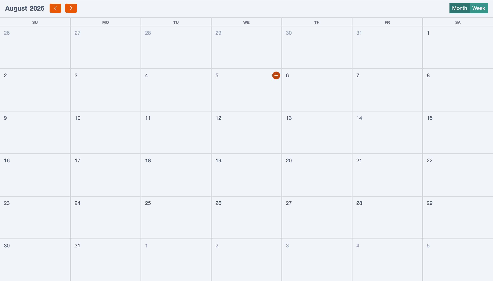
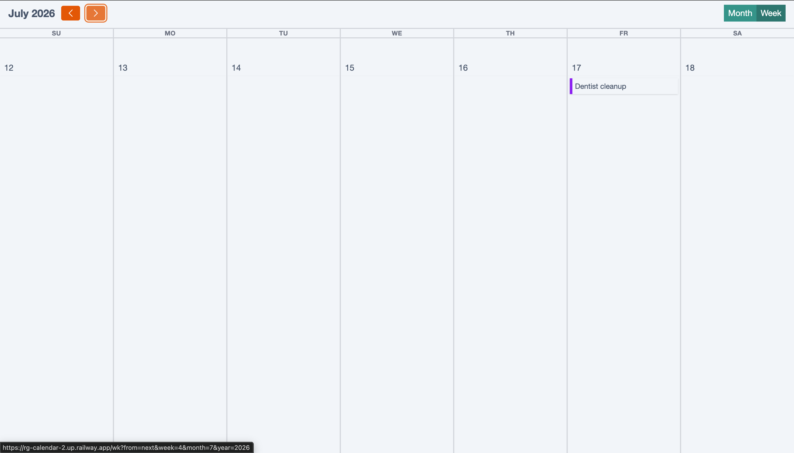
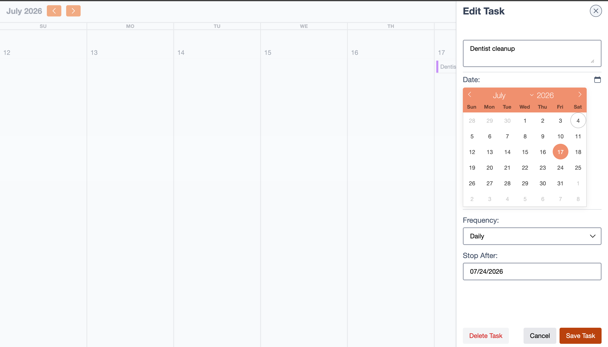
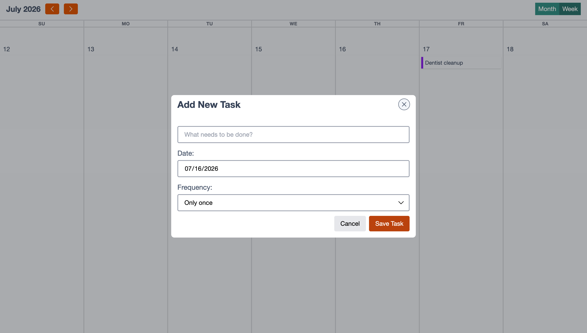

## Datastar Calendar

A high-performance, personal calendar tool built with a modern "Hypermedia-on-the-wire" stack. This project demonstrates a transition to fine-grained reactivity using **Datastar**, providing a desktop-class experience with minimal JavaScript.

### 🚀 The Stack

- **Backend:** [Go](https://go.dev/)
- **Templating:** [Templ](https://templ.guide/) (Type-safe HTML components)
- **Frontend Reactivity:** [Datastar](https://data-star.dev/) (Real-time server-sent events & signals)
- **Styling:** [Tailwind CSS](https://tailwindcss.com/)
- **Date Picking:** [Flatpickr](https://flatpickr.js.org/)

### ✨ Key Features

#### 🗓️ Smart Month View

A clean, grid-based overview of your month.

- **Responsive Day Cards:** Mobile-optimized "Add Task" buttons that appear on hover/tap.
- **Visual Contrast:** High-contrast task labels with color-coded categories.

#### ⚡ Side-Drawer Edit Experience

A context-aware editing interface that slides in from the right, allowing you to modify tasks without losing your place on the calendar.

- **Inline Date Selection:** Uses an inline Flatpickr instance to eliminate extra clicks.
- **Quick-Move Logic:** Efficient date rescheduling via intuitive signals.
- **Safe-Delete:** Two-step confirmation tooltip anchored to the delete action to prevent accidental data loss.

#### 📊 Smart Week View

A horizontal, 7-column layout that utilizes laptop screen real estate more effectively than traditional list views.

- **Stacked Date Headers:** Optimized vertical headers (e.g., "SUN" over "28") for maximum readability.

#### 🏗️ Architecture Note

This project utilizes Datastar’s unique approach to state management. Instead of full-page refreshes or complex JSON APIs, we use:

- Signals: To manage UI states like drawer visibility and the “Move Task” mode.
- SSE (Server-Sent Events): To stream HTML fragments directly back to the DOM based on user actions.

