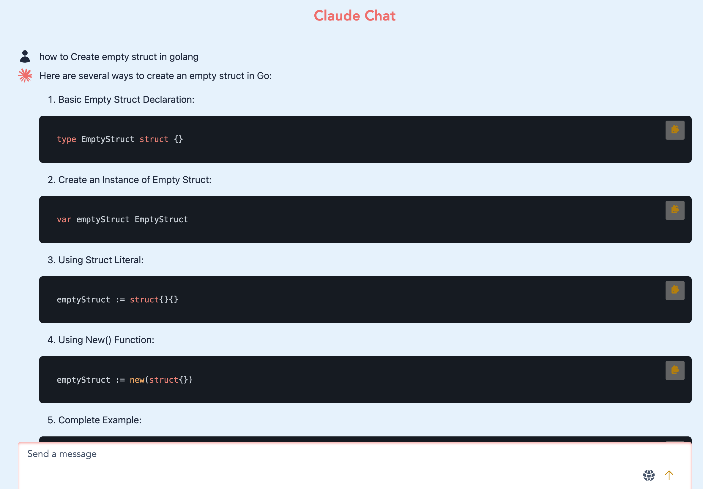

## Claude Chat

Welcome to the Claude Chat project! This application allows users to talk to Claude Model's

### Features

- Real-time Messaging
- Responsive Design
- Integrated Web Search Tool
- Image & PDF Summarization

### Model/Library/Frameworks used

- Claude (works for Claude 4.5 Haiku, Claude 3.5 Haiku, Sonnet models)
- Golang , templ , chi
- Datastar
- Zero md
- Tailwind, Open Props
- Turso

### Installation

To get started with the Claude Chat application, follow these steps:

1. Clone the repository:
   ```bash
   git clone https://github.com/gouthamrangarajan/go.git
   ```
2. Navigate to the project directory:
   ```bash
   cd datastar-claude-chat
   ```
3. Create a .env file with following values

   - CLAUDE_API_HEADER_VERSION
   - CALUDE_API_HEADER_FILE_UPLOAD
   - CLAUDE_API_KEY
   - CLAUDE_API_URL
   - CLAUDE_FILE_UPLOAD_API_URL
   - CLAUDE_MAX_TOKEN
   - CLAUDE_MODEL
   - CLAUDE_TEMPERATURE
   - CLAUDE_WEB_TOOL_TYPE
   - CLAUDE_WEB_TOOL_NAME
   - CALUDE_WEB_TOOL_MAX_USES
   - COOKIE_SECRET
   - ENVIRONMENT
   - TURSO_AUTH_TOKEN
   - TURSO_DATABASE_URL

4. Use Go & Templ (Terminal 1)
   ```bash
    templ generate --watch --proxy="http://localhost:3000" --cmd="go run ."
   ```
5. Use Tailwind cli (Terminal 2)
   ```bash
   npx @tailwindcss/cli -i ./input.css -o ./assets/css/styles.css --watch
   ```

### Usage

To run the application, use the following command:

Open your browser and navigate to `http://127.0.0.1:7331/` to start chatting!

### Deployed version

[rg-claude-chat](https://rg-claude-chat.up.railway.app/)


