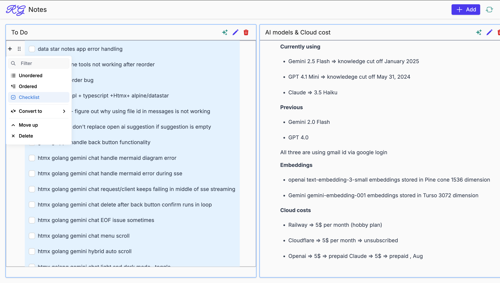

## DataStar Notes

DataStar Notes is a project designed to help users manage and organize their notes efficiently. It provides a simple and intuitive interface for creating, editing, and storing notes.

#### Features

- Passwordless login
- Create, edit, and delete notes
- WYSIWYG Editor
- AI Summary

### Model/Library/Frameworks used

- Gemini (works for Flash-2.0, Flash-2.5 & Flash-2.5-lite)
- Golang , templ , chi
- Datastar
- Editor js
- Zero md
- Tailwind, Open Props
- Supabase

### Installation

To get started with the Claude Chat application, follow these steps:

1. Clone the repository:
   ```bash
   git clone https://github.com/gouthamrangarajan/go.git
   ```
2. Navigate to the project directory:
   ```bash
   cd datastar-notes
   ```
3. Create a .env file with following values

   - COOKIE_SECRET
   - ENV
   - GEMINI_KEY
   - GEMINI_URL
   - LOGIN_REDIRECT_TO
   - SUPABASE_PUBLISHABLE_KEY
   - SUPABASE_SECRET_KEY
   - SUPABASE_API_URL
   - SUPABASE_DATA_FETCH_URL

4. Use Go & Templ (Terminal 1)
   ```bash
    templ generate --watch --proxy="http://localhost:3000" --cmd="go run ."
   ```
5. Use Tailwind cli (Terminal 2)
   ```bash
   npx @tailwindcss/cli -i ./input.css -o ./assets/css/styles.css --watch
   ```

### Usage

To run the application, use the following command:

Open your browser and navigate to `http://http://127.0.0.1:7331/` to start creating notes!

### Deployed version

[rg-notes](https://rg-notes.up.railway.app/)


