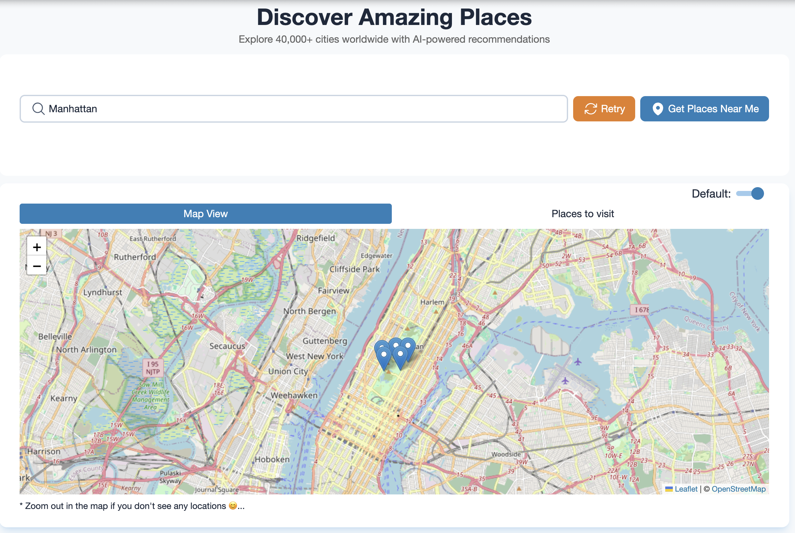

## DATA STAR Tourism Places to Visit

AI-powered recommendations of tourism places around 40k + cities in the world

### Features

- SSE (server sent events) using data star
- AI generated recommendations
- Ability to retry the recommendations
- Map & Tab view of tourism spots

### Library & Frameworks used

- Data Star
- Golang, templ & chi
- Tailwind, Open Props
- Gemini (works for Flash-2.0, Flash-2.5 & Flash-2.5-lite)
- Turso

### Installation

To get started with the application, follow these steps:

1. Clone the repository:
   ```bash
   git clone https://github.com/gouthamrangarajan/datastar-places-to-visit.git
   ```
2. Navigate to the project directory:
   ```bash
   cd datastar-places-to-vist
   ```
3. Create a .env file with following values
   - DEFAULT_CITY
   - DEFAULT_LAT
   - DEFAULT_LNG
   - GEMINI_KEY
   - GEMINI_STREAMING_URL
   - NO_OF_PLACES
   - NO_OF_DAYS_TO_CACHE_SPOTS
   - TURSO_AUTH_TOKEN
   - TURSO_URL
4. Use Go & Templ (Terminal 1)
   ```bash
    templ generate --watch --proxy="http://localhost:3000" --cmd="go run ."
   ```
5. Use Tailwind cli (Terminal 2)
   ```bash
   npx @tailwindcss/cli -i ./input.css -o ./assets/css/styles.css --watch
   ```

### Usage

To run the application, use the following command:

Open your browser and navigate to `http://http://127.0.0.1:7331/`

### Deployed version

[places-to-visit](https://placestovisit.up.railway.app/)


