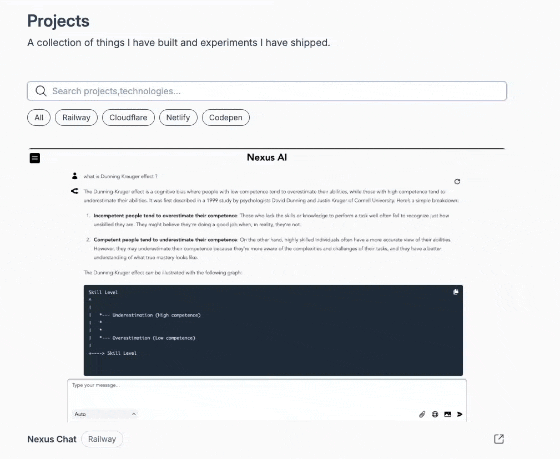

# 🚀 Go-Powered Semantic Portfolio

A high-performance, minimalist portfolio and experiment tracker. Built with a "No-SPA" philosophy, moving state management to the server and utilizing semantic discovery for project navigation.


## ✨ Features

- **Semantic Project Search:** Beyond simple tags. Uses **Voyage AI** text embeddings and **Turso Vector Search** to find projects based on intent and context (e.g., "Show me apps using real-time data").
- **Hypermedia-Driven UI:** Built with **Datastar**, utilizing Server-Sent Events (SSE) for smooth, reactive updates without the overhead of a heavy JavaScript framework (React/Next.js).
- **Type-Safe Backend:** Robust Go backend managing project metadata, vector synchronization jobs, and contact form processing.
- **Automated Contact Pipeline:** Integrated with **Resend API** for reliable delivery with professional HTML templates and automated Reply-To handling.
- **Performance Optimized:** Sub-100ms page transitions and minimal client-side JS bundle.

## 🛠️ The Tech Stack

- **Language:** [Go](https://go.dev/) (Standard Library + Chi Router)
- **Database:** [Turso](https://turso.tech/) (libSQL) with Vector Extensions
- **Embeddings:** [Voyage AI](https://www.voyageai.com/) (`voyage-large-2`)
- **Frontend:** [Datastar](https://data-star.dev/) (Hypermedia/SSE) & [Tailwind CSS](https://tailwindcss.com/)
- **Email:** [Resend](https://resend.com/)
- **Deployment:** [Railway](https://railway.app/)

## 🏗️ Architecture

### Semantic Search Workflow

1. Project metadata (Title, Tags, Description) is concatenated into a context string.
2. A background Go crawler fetches embeddings from the **Voyage AI API**.
3. Vectors are stored in **Turso** using the `vector32` extension.
4. User queries are embedded on-the-fly to perform a Cosine Similarity search.

```go
// The "Context String" used for embeddings
fmt.Sprintf("Project: %s\nStack: %s\nAbout: %s", title, tags, description)
```

## 🚀 Getting Started

### Prerequisites

- Go 1.21+
- Turso CLI
- Voyage AI & Resend API Keys

### Installation

1. Clone the repository:

   ```bash
   git clone https://github.com/yourusername/portfolio.git
   cd portfolio
   ```

2. Install dependencies:

   ```bash
   go mod tidy
   ```

3. Setup environment variables (`.env`):

   ```env
   EMAIL_FROM
   EMAIL_TO
   RESEND_API_KEY
   TURSO_AUTH_TOKEN
   TURSO_DATABASE_URL
   VOYAGE_API_KEY
   VOYAGE_EMBEDDINGS_URL
   VOYAGE_EMBEDDINGS_MODEL
   ```

4. Run the development server:
   ```bash
   go run main.go
   ```

## 📈 Experiments Shipped

This portfolio serves as a living document of things I have built. Check out the [Projects section](https://rg-portfolio.up.railway.app/projects) to see my experiments with AI, Go, and distributed systems.

---

Built with ❤️ and **Go**.
