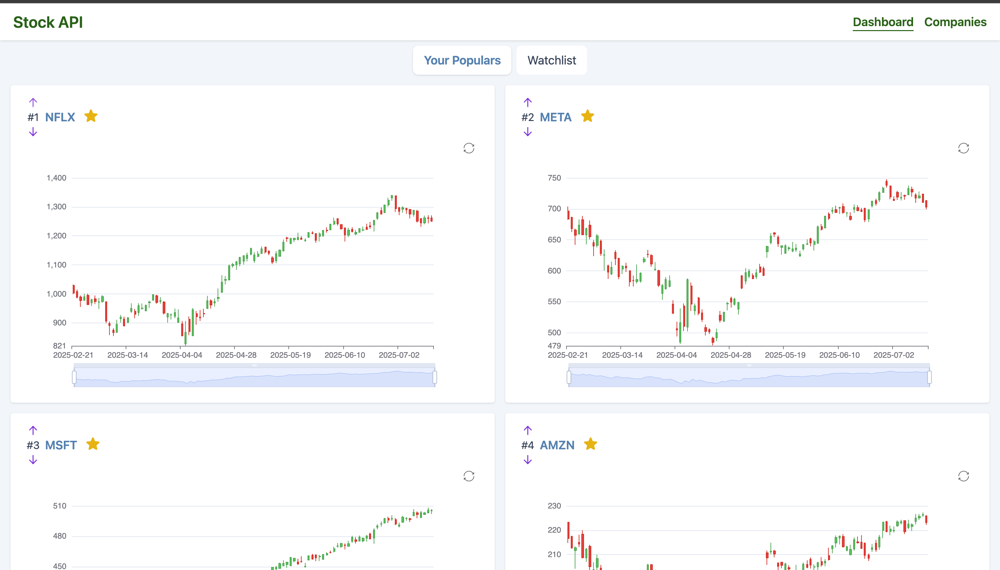
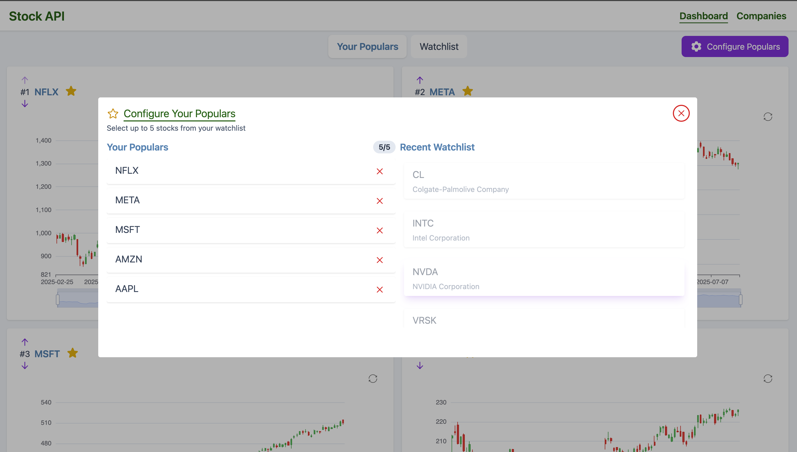
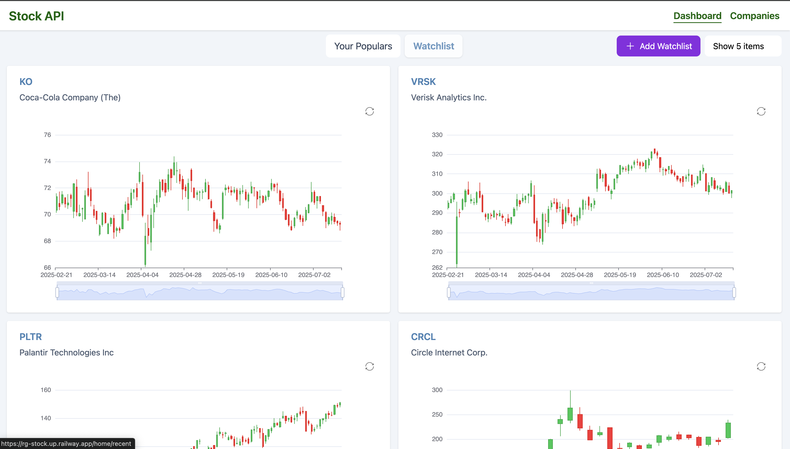
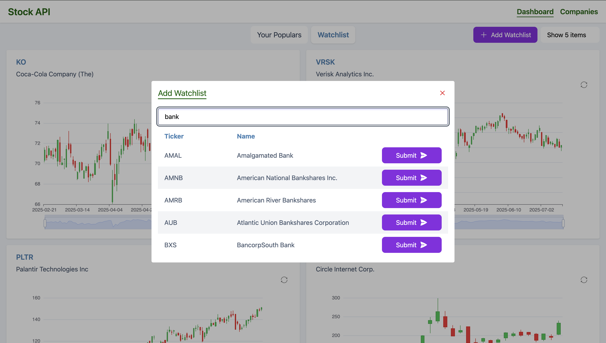
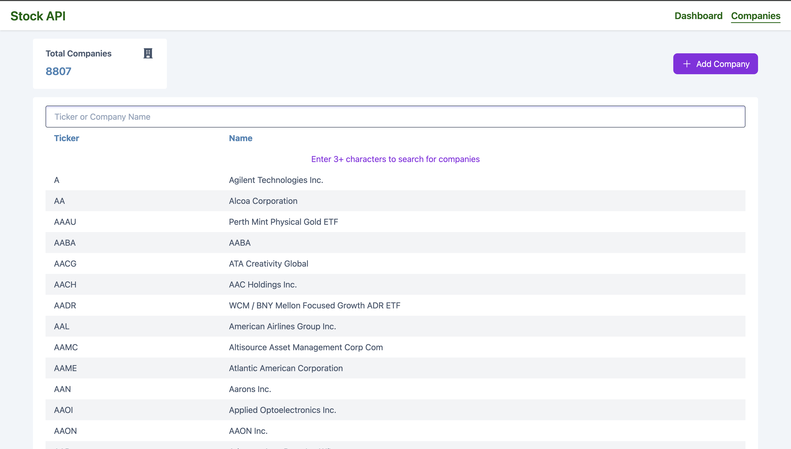
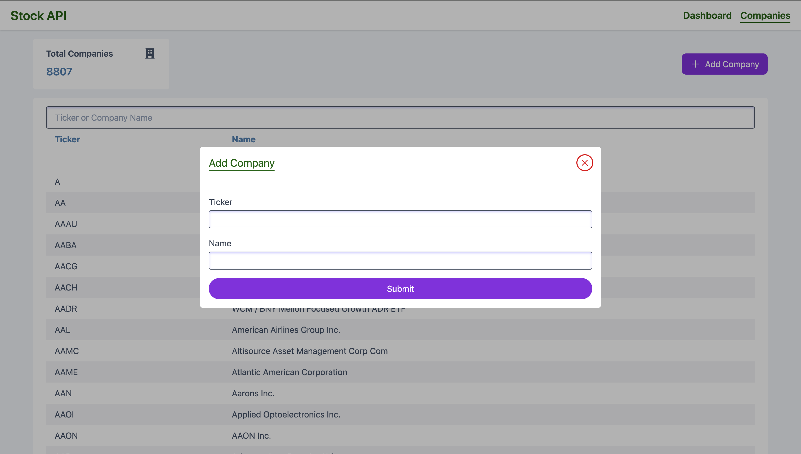

## DATA STAR Stock

Simple tool for tracking stock using Golang & Data star

### Features

- SSE (server sent events) using data star
- Candlestick charts visualization of past 6 months NYSE & NASDAQ stocks

### Library & Frameworks used

- Data Star
- Golang, templ & chi
- Tailwind, Open Props
- Firebase Auth & Firestore Db
- Redis
- Alphavantage API
- Echarts

### Installation

To get started , follow these steps:

1. Clone the repository:
   ```bash
   git clone https://github.com/gouthamrangarajan/datastar-stock.git
   ```
2. Navigate to the project directory:
   ```bash
   cd datastar-stock
   ```
3. Create a .env file with following values
   - ALPAVANTAGE_API_KEY
   - ALPAVANTAGE_URL
   - COMPANIES_LIMIT
   - ENVIRONMENT
   - FIREBASE_TYPE
   - FIREBASE_PROJECT_ID
   - FIREBASE_PRIVATE_KEY_ID
   - FIREBASE_PRIVATE_KEY
   - FIREBASE_CLIENT_EMAIL
   - FIREBASE_CLIENT_ID
   - FIREBASE_AUTH_URI
   - FIREBASE_TOKEN_URI
   - FIREBASE_AUTH_PROVIDER_X509_CERT_URL
   - FIREBASE_CLIENT_X509_CERT_URL
   - FIREBASE_UNIVERSE_DOMAIN
   - GOOGLE_IDENTITY_SIGNIN_URL
   - REDIS_ADDRESS
   - REDIS_PASSWORD
   - REDIS_USERNAME
4. Use Go & Templ (Terminal 1)
   ```bash
    templ generate --watch --proxy="http://localhost:3000" --cmd="go run ."
   ```
5. Use Tailwind cli (Terminal 2)
   ```bash
   npx @tailwindcss/cli -i ./input.css -o ./assets/css/styles.css --watch
   ```

### Usage

To run the application, use the following command:

Open your browser and navigate to `http://http://127.0.0.1:7331/`







