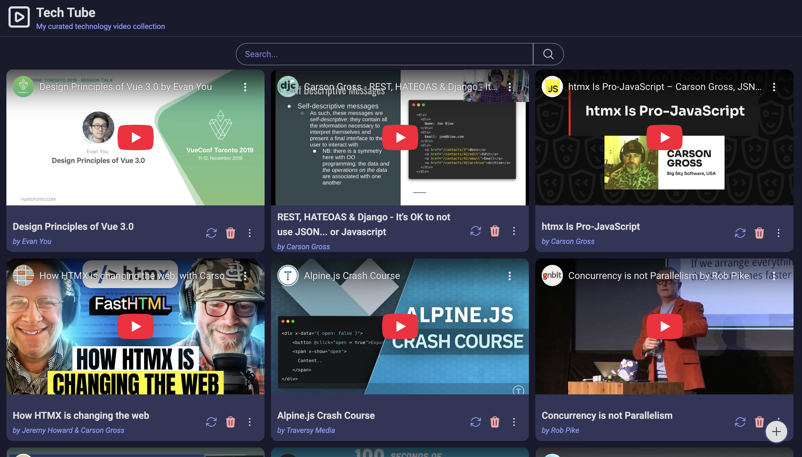

## Tech Tube

### Description

Technology video collection with advanced search. Features: Go-powered backend, YouTube API integration for video metadata, dynamic tagging, and vectorization to Pinecone. Implements Gen AI (Open AI) for intelligent query rephrasing and semantic search, all delivered via a Hypermedia-driven UI (Datastar, Tailwind CSS) with YouTube iframe API integration.

### Features

- **Go-Powered Backend**: Experience a high-performance application built on a robust Go backend.
- **YouTube API Integration**: Access rich video metadata and content from YouTube directly within the app.
- **Intelligent Query Rephrasing**: Utilizes OpenAI's Generative AI to rephrase user queries for improved search accuracy and relevance.
- **Semantic Search**: Find what you're looking for quickly with advanced semantic search capabilities.
- **Dynamic Tagging**: Automatically tags videos for easier categorization and searchability.
- **Vectorization with Pinecone**: Leverage vector databases for enhanced content organization and retrieval.
- **Hypermedia-Driven UI**: A responsive and modern user interface built using Datastar and Tailwind CSS.
- **YouTube Iframe API Integration**: Seamlessly integrate YouTube videos for a fluid viewing experience.

### Model/Library/Frameworks used

- OpenAI
- Golang , templ , chi
- Datastar
- Youtube API
- Tailwind, Open Props
- Pinecone, Firebase

### Installation

1. Clone the repository:
   ```bash
   git clone https://github.com/gouthamrangarajan/go.git
   ```
2. Navigate to the project directory:
   ```bash
   cd datatar-web-learnings
   ```
3. Create a .env file with following values

   - FIREBASE_API_KEY
   - FIREBASE_AUTH_DOMAIN
   - FIREBASE_TYPE
   - FIREBASE_PROJECT_ID
   - FIREBASE_PRIVATE_KEY_ID
   - FIREBASE_PRIVATE_KEY
   - FIREBASE_CLIENT_EMAIL
   - FIREBASE_CLIENT_ID
   - FIREBASE_AUTH_URI
   - FIREBASE_TOKEN_URI
   - FIREBASE_AUTH_PROVIDER_X509_CERT_URL
   - FIREBASE_CLIENT_X509_CERT_URL
   - FIREBASE_UNIVERSE_DOMAIN
   - ITEMS_PER_PAGE
   - OPENAI_API_EMBEDDING_MODEL
   - OPENAI_API_EMBEDDING_URL
   - OPENAI_API_KEY
   - OPENAI_API_MODEL
   - OPENAI_API_URL
   - PINECONE_API_KEY
   - PINECONE_API_VERSION
   - PINECONE_FILTER_SCORE
   - PINECONE_HOST_URL
   - PINECONE_TOPK
   - RATE_LIMIT_REQUESTS
   - RATE_LIMIT_SECONDS
   - VOYAGE_API_KEY
   - VOYAGE_EMBEDDINGS_URL
   - VOYAGE_EMBEDDINGS_MODEL
   - YT_API_KEY
   - YT_API_URL

4. Use Go & Templ (Terminal 1)
   ```bash
    templ generate --watch --proxy="http://localhost:3000" --cmd="go run ."
   ```
5. Use Tailwind cli (Terminal 2)
   ```bash
   npx @tailwindcss/cli -i ./input.css -o ./assets/css/styles.css --watch
   ```

### Usage

To run the application, use the following command:

Open your browser and navigate to `http://127.0.0.1:7331/` to start checking!

### Deployed version

[rg-tech-tube](https://rg-tech-tube.up.railway.app/)


