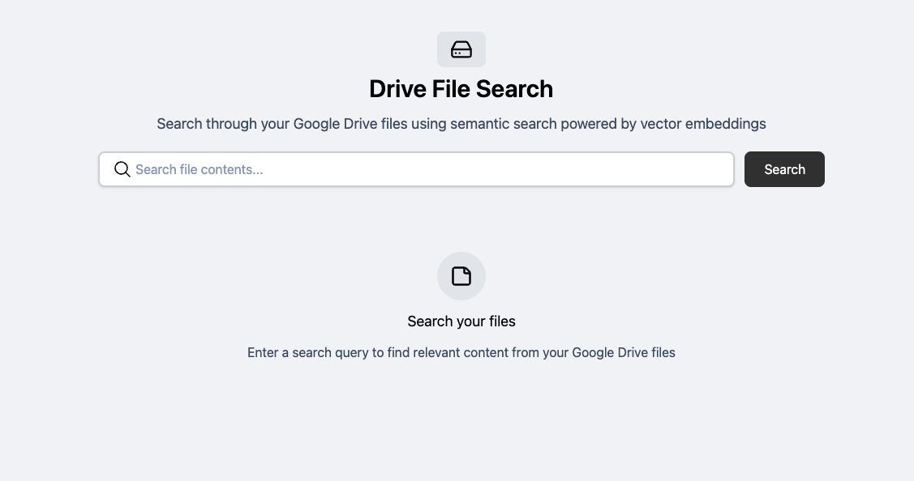

# 📑 Google Drive Semantic Search & Markdown Engine

A full-stack Go application that transforms Google Drive documents into a searchable, high-performance web interface. It automates the pipeline of: **Fetch → Convert to Markdown → Vectorize → Semantic Search.**


## 🚀 The Pipeline Architecture

This project is split into two core layers:

### 1. The Background Sync (Jobs)

Located in `/jobs`, this service handles the "Heavy Lifting":

- **Content Extraction:** Uses Google Drive API v3 to pull document content.
- **Markdown Transformation:** Converts raw document data into clean Markdown for web-optimized rendering.
- **Vectorization:** Generates high-dimensional embeddings (via Voyage AI) for every document.
- **Persistence:** Syncs both the Markdown content and the Vector data into **Turso (LibSQL)** for edge-ready access.

### 2. The Web Interface (UI)

A reactive frontend built with a "No-JS-Framework" philosophy:

- **Server-Side Components:** Built using [Templ](https://templ.guide/), providing type-safe HTML components in Go.
- **Real-time Interactivity:** Uses [Datastar](https://data-star.dev/) and Server-Sent Events (SSE) to handle search queries and content rendering without full page reloads.
- **Markdown Rendering:** Renders synced Google Drive content directly in the browser with custom styling.

## ✨ Key Features

- **Semantic Content Search:** Search through your Google Drive files by _meaning_, not just keywords, powered by Turso's native vector extension.
- **Offline-First Content:** Syncs your Google Docs locally in Markdown format so they are instantly readable and searchable.
- **Hypermedia-Driven UI:** Experience SPA-like speed and reactivity using pure Go and SSE.
- **OAuth2 Protected:** Secure integration with Google Cloud for user-controlled data access.

## 🛠️ Project Structure

```bash
├── /                   # Entry points for the Web Server
├── jobs/               # Go routines for GDrive sync & Voyage AI vectorization
├── components/         # Templ components and Datastar logic
├── services/
│   ├── db              # Turso/LibSQL schema and vector queries
│   ├── googleDrive     # Google API integration & Markdown converters
└── .env.example        # Configuration for OpenRouter, Voyage, Turso, and Google
```

## ⚙️ Setup

1. **Google Cloud:** Create OAuth2 credentials and enable the Drive API.
2. **Database:** Initialize your Turso database with the vector extension enabled.
3. **Environment:**
   ```bash
   cp .env.example .env
   # Fill in TURSO_URL, VOYAGE_API_KEY, and GOOGLE_CREDENTIALS
   ```
4. **Run Sync:**
   ```bash
   go run jobs/sync/main.go # Scrapes GDrive and populates Turso
   ```
5. **Start Web Server:**
   ```bash
   go run main.go  # Starts the Templ + Datastar UI
   ```

## 🛡️ Security & Performance

- **Streaming UI:** Search results are streamed using SSE for a "zero-latency" feel.
- **Vector Indexing:** Optimized SQL queries using `vector_top_k` for sub-millisecond similarity matching.
- **Markdown Caching:** Documents are cached in Turso to avoid hitting Google API rate limits.

---

Built by [Goutham Rangarajan](https://github.com/gouthamrangarajan)
