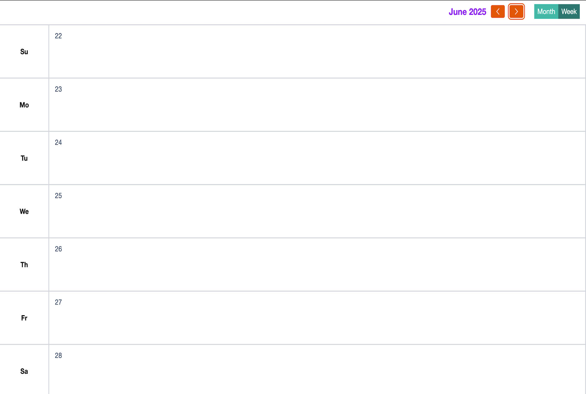

## HTMX Calendar

Welcome to the Calendar project! This application allows users to track events in a calendar

### Model/Library/Frameworks used

- Golang , templ , chi
- Htmx, Alpine
- Flat pickr
- Tailwind, Open Props
- Supabase
- Resend email

### Installation

To get started with the calendar application, follow these steps:

1. Clone the repository:
   ```bash
   git clone https://github.com/gouthamrangarajan/htmx-calendar.git
   ```
2. Navigate to the project directory:
   ```bash
   cd htmx-calendar
   ```
3. Create a .env file with following values

   - ENV
   - SUPABASE_ANON_KEY
   - SUPABASE_API_URL
   - SUPABASE_AUTH_ISSUER
   - SUPABASE_DATA_FETCH_URL
   - SUPABASE_LOGIN_URL

   .env file for job (create in jobs/reminder folder)

   - ENV
   - REMINDER_EMAIL_FROM
   - REMINDER_EMAIL_SUBJECT
   - REMINDER_EMAIL_TO
   - RESEND_API_KEY
   - SUPABASE_API_URL
   - SUPABASE_SERVICE_ROLE
   - SUPABASE_USER_ID

4. Use Go & Templ (Terminal 1)
   ```bash
    templ generate --watch --proxy="http://localhost:3000" --cmd="go run ."
   ```
5. Use Tailwind cli (Terminal 2)
   ```bash
   npx @tailwindcss/cli -i ./input.css -o ./assets/css/styles.css --watch
   ```
6. To run email job
   ```bash
   cd jobs/reminder
   go run main.go
   ```

### Usage

To run the application, use the following command:

Open your browser and navigate to `http://http://127.0.0.1:7331/`

### Deployed version

[rg-calendar](https://rg-calendar.up.railway.app)


