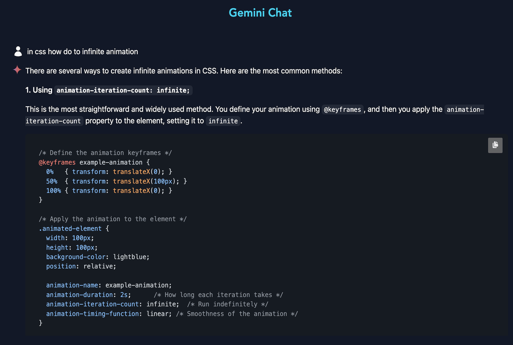

## Gemini Chat

Welcome to the Gemini Chat project! This application allows users to talk to Google Gemini Model

### Features

- Real-time messaging
- Responsive design

### Model/Library/Frameworks used

- Gemini (works for Flash-2.0, Flash-2.5 & Flash-2.5-lite)
- Golang , templ , chi
- Htmx, Alpine
- Zero md
- Tailwind, Open Props
- Turso

### Installation

To get started with the Gemini Chat application, follow these steps:

1. Clone the repository:
   ```bash
   git clone https://github.com/gouthamrangarajan/htmx-gemini-chat.git
   ```
2. Navigate to the project directory:
   ```bash
   cd htmx-gemini-chat
   ```
3. Create a .env file with following values
   - COOKIE_SECRET
   - ENVIRONMENT
   - GEMINI_KEY
   - GEMINI_STREAMING_URL
   - TURSO_AUTH_TOKEN
   - TURSO_DATABASE_URL
4. Use Go & Templ (Terminal 1)
   ```bash
    templ generate --watch --proxy="http://localhost:3000" --cmd="go run ."
   ```
5. Use Tailwind cli (Terminal 2)
   ```bash
   npx @tailwindcss/cli -i ./input.css -o ./assets/css/styles.css --watch
   ```

### Usage

To run the application, use the following command:

Open your browser and navigate to `http://http://127.0.0.1:7331/` to start chatting!

### Deployed version

[rg-gemini-chat](https://rg-gemini-chat.up.railway.app/)


